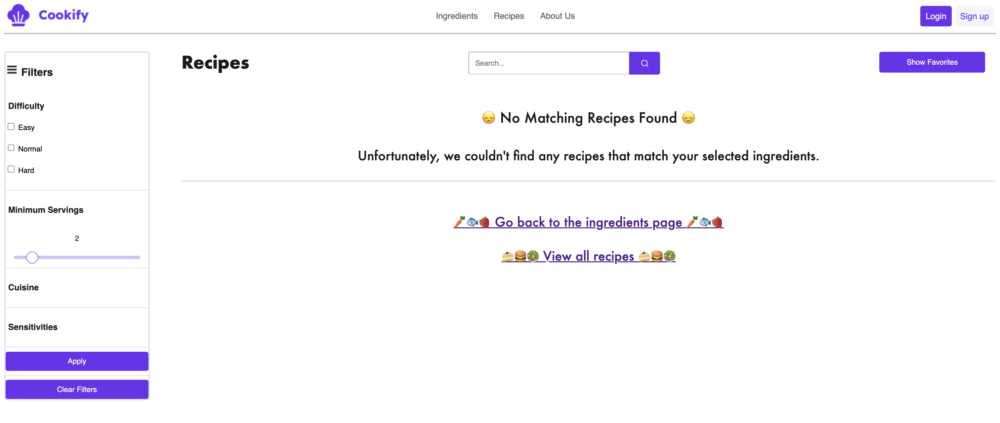

# Cookify

## 1. Idea Explanation - A reminder

The main idea behind this project is to provide a platform where users can easily search for personalized recipes based on ingredients they have in their home.
They can also explore new tastes and meals by just entering the Recipes page

## 3. Order of Operations

1. The user lands on the homepage where an introduction is written and button to pages are displayed.
2. The user can log in using their credentials. If they don't have an account, they can sign up.
3. The user can enter the Ingerediants page to view all available ingredients.
4. The user can select, search and filter ingredients based on their preferences.
5. The user can click on the 'Show Recipes' button to view suitable recipes.
6. If logged in, the user can see his favorite recipes by clicking on the 'Show Favorites' button.
7. The user can apply filters and search for specific recipes. If logged in, they will be shown by sign-up preferences.
8. The user clicks on a recipe to view the details.
9. If logged in, The user can save a single recipe to their favorites by clicking on the 'Save to Favorites' button on a recipe.
10. The user can now cook the recipe by following the instructions and create a delicious meal!.
11. The user can log out by clicking on the 'Log Out' button.

## 3. Screenshots

*The homepage displays all ingredients. Users can filter and search for ingredients here.*

*This is the sign up page.*

*This is the page where all available ingredients are displayed.*

*This is the login page.*

*This screenshot shows the page when no suitable recipes are found.*

*This is the page where all recipes are displayed.*

*This screenshot shows the details of a single recipe.*